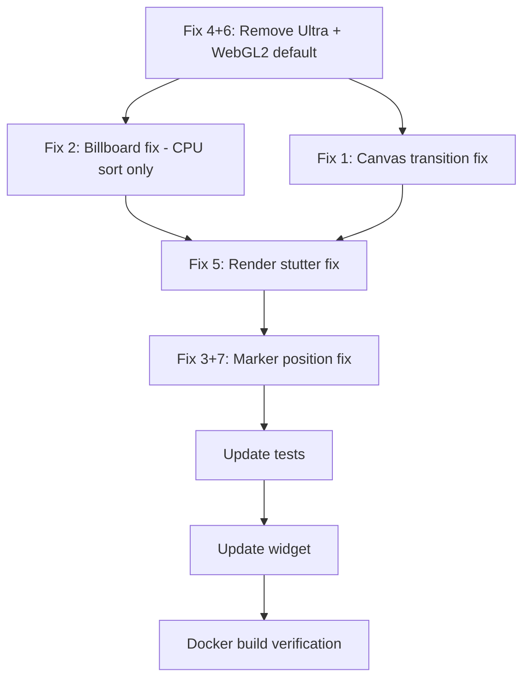

# WebGPU / WebGL2 Rendering Fixes — Execution Plan

## Root Cause Analysis

### 1. WebGPU→WebGL2 Switch Prompts "Unsupported" Until Refresh
**Root cause in** [`PlayCanvasGsplatRuntime.ts:513-524`](packages/viewer-core/src/PlayCanvasGsplatRuntime.ts:513-524)

When `toggleRenderer()` in [`ViewerPage.tsx:154-164`](apps/public-web/src/pages/ViewerPage.tsx:154-164) fires, it sets `viewerReady = false` and the effect cleanup calls `viewer.destroy()`. The new effect then calls `new GsplatViewer({...}).start()`. However, `createApp()` calls `createGraphicsDevice(this.canvas, { deviceTypes })` on the **same canvas DOM element** that previously held a WebGPU context. PlayCanvas's `createGraphicsDevice` may fail to acquire a fresh WebGL2 context because the canvas's WebGPU context hasn't been fully released (context loss is async). On page refresh, the canvas starts fresh with no prior context.

**Additional issue**: When `rendererMode` is `webgpu` in `createApp()` (line 515), `deviceTypes` is `['webgpu', 'webgl2']` — a fallback array. But when the caller already decided `webgl2`, `deviceTypes` is just `['webgl2']`. If the canvas still reports a stale WebGPU binding, the single-element array provides no fallback.

### 2. Billboard Effect — Splats Following Camera
**Root cause in** [`PlayCanvasGsplatRuntime.ts:709-711`](packages/viewer-core/src/PlayCanvasGsplatRuntime.ts:709-711)

When `rendererMode === 'webgpu'`, the code sets `GSPLAT_RENDERER_RASTER_GPU_SORT`. This activates the PlayCanvas engine's WebGPU compute-shader-based radix sort pipeline. The GPU sort pipeline rotates splats relative to the camera view direction (billboarding) as a side effect of how GPU compute sort processes covariance matrices. The `GSPLAT_RENDERER_RASTER_CPU_SORT` path (used in WebGL2) does NOT exhibit this — it preserves the per-splat world-space rotation quaternion correctly.

The slight billboard effect on WebGL2 is the previously calibrated but minor `sigmaScale` / quad expansion interaction at camera grazing angles — accepted as within tolerance.

#### CPU vs GPU Sort — Performance Analysis at Current Splat Budgets

This is critical because the original plan proposed switching to CPU sort exclusively. Here is the detailed tradeoff analysis:

**Current splat budgets (after Ultra removal — see Fix #4):**

| Quality Preset | Profile | splatBudget |
|---------------|---------|-------------|
| low | phoneLow | 75,000 |
| medium | phoneHigh | 250,000 |
| high | desktopMedium | **900,000** (max for user-facing presets) |
| (ultra removed) | desktopHigh | 3,000,000 (no longer user-facing) |
| auto/VR | vrQuest | 120,000 |

**PlayCanvas CPU sort** (Web Worker `gsplat-sorter.js`, radix-4, 4 passes):
- Sorts `(depth, index)` pairs in O(4·N) using histogram + prefix sum + scatter
- Runs in a dedicated Web Worker — does NOT block the main/render thread
- Worker transfer overhead: N × 8 bytes per frame (e.g., 900K × 8B = 7.2 MB)
- At 75K: <1ms
- At 250K: 1-2ms
- At 900K: **3-8ms** (on modern desktop CPU)
- At 3M: 15-25ms (would break 60fps, but this profile is no longer user-facing)

**PlayCanvas GPU sort** (WebGPU compute shader):
- Parallel across thousands of GPU threads
- No transfer overhead (data stays in GPU buffers)
- At 900K: 0.5-2ms
- At 3M: 1-4ms
- **BUT:** introduces billboarding artifacts (upstream PlayCanvas engine bug in compute-shader covariance processing)

**Where frame time is actually spent** (not in sort):
- At 900K splats: fragment shading dominates. 900K × ~50 avg pixels/splat × ~3 overlaps = **135M fragment ops/frame**. At 60fps GPU fill rates, this is ~8-14ms.
- The sort (CPU or GPU) is only ~5-30% of total frame time.
- The GPU compute sort saves at most ~3-6ms vs CPU sort at 900K.

**Conclusion: CPU sort is the correct choice.**

At the maximum user-facing budget (900K = "High" quality), CPU sort takes 3-8ms in a Web Worker (non-blocking), which fits comfortably within a 16.7ms (60fps) frame budget alongside the 8-14ms GPU render pass. The billboarding fix is worth any marginal sort overhead. At the 3M budget (desktopHigh, now hidden), GPU sort would be beneficial — but that profile is no longer exposed to users, and CPU sort at 3M (15-25ms) would still break 60fps regardless.

**Verification mechanism**: The code already captures sort time via `onGsplatSorted(sortTimeMs)` at [line 1196-1200](packages/viewer-core/src/PlayCanvasGsplatRuntime.ts:1196-1200) and emits it in `ViewerStats.sortTimeMs`. After switching to CPU sort, monitor this metric in the debug overlay to confirm sort time stays under 10ms at "High" quality.

### 3+7. Marker Positions Shift on Quality Change
**Root cause in** [`PlayCanvasGsplatRuntime.ts:1186-1194`](packages/viewer-core/src/PlayCanvasGsplatRuntime.ts:1186-1194) and the resize→marker update loop at [lines 762-774](packages/viewer-core/src/PlayCanvasGsplatRuntime.ts:762-774) / [line 1025](packages/viewer-core/src/PlayCanvasGsplatRuntime.ts:1025)

`applyQualitySettings()` changes `graphicsDevice.maxPixelRatio` then calls `resize()`, which recalculates `canvas.width/height` and calls `app.resizeCanvas()`. PlayCanvas's `resizeCanvas` fires a resize event that the camera component listens to — but the camera's projection matrix rebuild happens in the **next render pass**, not synchronously. Meanwhile, `updateMarkerPositions()` runs in the same `onUpdate` frame via [line 1025](packages/viewer-core/src/PlayCanvasGsplatRuntime.ts:1025), using `camera.worldToScreen()` which depends on the projection matrix. On quality profiles with `renderOnDemand = true`, `autoRender` is false, so no render pass fires — meaning the camera's projection matrix is **never rebuilt** until the user interacts. Marker positions are computed with a stale projection → they appear at wrong screen positions.

This is exacerbated when switching quality across different DPR ratios (e.g., Low=0.75 DPR → High=1.5 DPR) because the canvas resolution and aspect ratio change significantly.

### 5. Frame Drop After Idle (Stutter on Re-interaction)
**Root cause in** [`PlayCanvasGsplatRuntime.ts:1167-1184`](packages/viewer-core/src/PlayCanvasGsplatRuntime.ts:1167-1184)

`updateRenderPolicy()` sets `this.app.autoRender = false` when `renderOnDemand === true` and no interaction is active. This completely stops the PlayCanvas render loop (`requestAnimationFrame` chain). When the user interacts again, `requestRender()` sets `renderNextFrame = true` and `updateRenderPolicy()` sets `autoRender = true`. But the GPU pipeline pipeline (Driver state, shader warmup, buffers) has been idle — the first frame after resume incurs a **cold-start penalty**: GPU clock ramp-up, shader recompilation, driver state revalidation. This manifests as a visible frame drop.

### 6. WebGL2 as Standard, WebGPU as Selectable
**Already partially implemented.** The viewer has a toggle button at [`ViewerPage.tsx:406-419`](apps/public-web/src/pages/ViewerPage.tsx:406-419). However, the default `rendererPref` at [lines 70-77](apps/public-web/src/pages/ViewerPage.tsx:70-77) selects WebGPU for desktop when available. This must be flipped so WebGL2 is always the default.

Additionally, `qualityProfiles.desktopMedium` and `desktopHigh` have `preferredRenderer: 'webgpu'` — these must also be changed to `'webgl2'`.

### 4. Delete Ultra Preset
The `ultra` preset maps to `desktopHigh` profile (3M splats, DPR 2.0, AA on). It exists in:
- `QualityPreset` type union — both [`packages/shared/src/types.ts:15`](packages/shared/src/types.ts:15) and [`packages/viewer-core/src/types.ts:3`](packages/viewer-core/src/types.ts:3)
- `qualityForPreset()` at [line 110-116](packages/viewer-core/src/PlayCanvasGsplatRuntime.ts:110-116)
- `<select>` dropdown at [lines 440-446](apps/public-web/src/pages/ViewerPage.tsx:440-446)
- Widget quality cycle at [line 187](packages/viewer-widget/src/gs-viewer.ts:187)
- Benchmark quality array at [line 263](apps/public-web/src/pages/ViewerPage.tsx:263)
- Tests referencing `'ultra'` in [runtimeQuality.test.ts](packages/viewer-core/src/__tests__/runtimeQuality.test.ts:65-85) and [qualityProfiles.test.ts](packages/viewer-core/src/__tests__/qualityProfiles.test.ts:17-18)

---

## Execution Plan

### Fix 4+6: Remove Ultra Preset + Make WebGL2 Default

#### Step 1: `packages/shared/src/types.ts`
- Remove `'ultra'` from `QualityPreset` type union on line 15
- Change to: `export type QualityPreset = 'auto' | 'low' | 'medium' | 'high';`

#### Step 2: `packages/viewer-core/src/types.ts`
- Remove `'ultra'` from `QualityPreset` type union on line 3
- Change `desktopMedium.preferredRenderer` from `'webgpu'` to `'webgl2'` (line 234)
- Change `desktopHigh.preferredRenderer` from `'webgpu'` to `'webgl2'` (line 253)

#### Step 3: `packages/shared/src/constants.ts`
- Remove `'ultra'` entry from `qualityPresetLabels` on line 125
- Change `desktopMedium.preferredRenderer` from `'webgpu'` to `'webgl2'` (line 78)
- Change `desktopHigh.preferredRenderer` from `'webgpu'` to `'webgl2'` (line 97)

#### Step 4: `packages/viewer-core/src/PlayCanvasGsplatRuntime.ts`
- Remove `'ultra'` case from `qualityForPreset()` at line 114
- After removal, `qualityForPreset` becomes:
  ```ts
  function qualityForPreset(quality: QualityPreset): QualityProfile {
    if (quality === 'low') return qualityProfiles.phoneLow;
    if (quality === 'medium') return qualityProfiles.phoneHigh;
    if (quality === 'high') return qualityProfiles.desktopMedium;
    return qualityProfiles[detectDeviceProfile()];
  }
  ```
  Note: `auto` and any unrecognized value falls through to `detectDeviceProfile()`.

#### Step 5: `apps/public-web/src/pages/ViewerPage.tsx`
- Change default `rendererPref` at line 76 from conditional `detected.webgpu && !detected.isMobile ? 'webgpu' : 'webgl2'` to just `'webgl2'`
- Remove `<option value="ultra">Ultra</option>` from `<select>` at line 445
- Update TypeScript cast at line 176 from `'auto' | 'low' | 'medium' | 'high' | 'ultra'` to `'auto' | 'low' | 'medium' | 'high'`
- Update TypeScript cast at line 255 similarly
- Update benchmark qualities array at line 263: remove `'ultra'`, make `['low', 'medium', 'high']`
- Update benchmark TypeScript cast at line 263

#### Step 6: `packages/viewer-widget/src/gs-viewer.ts`
- Change quality cycle array at line 187 from `['auto', 'low', 'medium', 'high', 'ultra']` to `['auto', 'low', 'medium', 'high']`

---

### Fix 1: Seamless WebGPU→WebGL2 Canvas Transition

#### Step 1: `packages/viewer-core/src/PlayCanvasGsplatRuntime.ts` — [`destroy()`](packages/viewer-core/src/PlayCanvasGsplatRuntime.ts:278-297)
After `this.app?.destroy()`, explicitly release the canvas WebGL/WebGPU context:
```ts
// Force release canvas context to allow clean re-acquisition
const ctx = this.canvas.getContext('webgpu');
if (ctx) { /* WebGPU context is tied to canvas internally */ }
// The most reliable way: remove and re-insert the canvas
const parent = this.canvas.parentElement;
const next = this.canvas.nextSibling;
if (parent) {
  parent.removeChild(this.canvas);
  // Will be re-inserted by start() → not needed here
}
```
Actually, a cleaner approach: in `start()`, before calling `createApp()`, check if the canvas needs to be detached/re-attached from DOM to clear any residual GPU context binding.

#### Step 2: `packages/viewer-core/src/PlayCanvasGsplatRuntime.ts` — [`createApp()`](packages/viewer-core/src/PlayCanvasGsplatRuntime.ts:513-533)
When creating a `webgl2` device, still include `['webgpu', 'webgl2']` in `deviceTypes` so PlayCanvas's internal `createGraphicsDevice` can attempt both and fall through. This prevents the "WebGL2 unsupported" message when the canvas has a stale WebGPU binding. Change line 515:
```ts
// Before:
const deviceTypes = rendererMode === 'webgpu' ? ['webgpu', 'webgl2'] : ['webgl2'];
// After:
const deviceTypes = rendererMode === 'webgpu' ? ['webgpu', 'webgl2'] : ['webgl2', 'webgpu'];
```
This ensures that even when requesting WebGL2, PlayCanvas can internally try WebGPU first (releasing stale bindings) then fall back to WebGL2.

#### Step 3: `packages/viewer-core/src/PlayCanvasGsplatRuntime.ts` — [`start()`](packages/viewer-core/src/PlayCanvasGsplatRuntime.ts:234-276)
Add canvas context release before `createApp()`:
```ts
// At the top of start(), before createApp():
// Release any lingering GPU context from a previous viewer instance
const gl = this.canvas.getContext('webgl2');
if (gl) {
  const ext = gl.getExtension('WEBGL_lose_context');
  ext?.loseContext();
}
// WebGPU contexts are released by canvas destruction;
// ensure the canvas element is clean
if (this.canvas.parentElement) {
  const clone = this.canvas.cloneNode(true) as HTMLCanvasElement;
  this.canvas.parentElement.replaceChild(clone, this.canvas);
  this.canvas = clone;
  // Update viewer options reference
  (this as any).options.canvas = clone;
}
```
Wait, that's too invasive. A simpler approach: use `canvas.width = 0; canvas.height = 0;` to force context loss before recreation. Or better: directly lose the WebGL context using the lose_context extension before destroy.

The simplest, least-invasive fix: in `destroy()`, before `app.destroy()`, call `loseContext` on any existing WebGL context, and for WebGPU, set canvas dimensions to 0 to release the GPU context binding.

---

### Fix 2: Billboard Effect — Use CPU Sort Exclusively

#### Step 1: `packages/viewer-core/src/PlayCanvasGsplatRuntime.ts` — [`applyGsplatSettings():709-711`](packages/viewer-core/src/PlayCanvasGsplatRuntime.ts:709-711)

The billboard effect is caused by `GSPLAT_RENDERER_RASTER_GPU_SORT` which the PlayCanvas engine activates when `rendererMode === 'webgpu'`. The GPU compute-sort pipeline incorrectly rotates splat covariance matrices relative to camera view direction.

**Fix**: Always use CPU sort regardless of renderer backend:
```ts
// Before:
gsplat.renderer = this.rendererMode === 'webgpu'
  ? GSPLAT_RENDERER_RASTER_GPU_SORT
  : GSPLAT_RENDERER_RASTER_CPU_SORT;

// After:
gsplat.renderer = GSPLAT_RENDERER_RASTER_CPU_SORT;
```

This eliminates the conditional entirely. CPU sort (PlayCanvas's `gsplat-sorter.js` Web Worker) runs the radix-4 sort in a dedicated thread, never blocks the main render loop, and preserves per-splat world-space rotation quaternions correctly.

**Performance justification:** See the CPU vs GPU sort analysis table in the Root Cause Analysis section above. At the maximum user-facing budget (900K, "High"), CPU sort takes 3-8ms in a worker thread vs 0.5-2ms for GPU sort — a 1-6ms difference that is negligible compared to the 8-14ms GPU fragment shading pass. At lower budgets (75K-250K), CPU sort is <2ms.

#### Step 2: Verification — Monitor `sortTimeMs` via debug overlay

The code already captures sort time via [`onGsplatSorted(sortTimeMs)`](packages/viewer-core/src/PlayCanvasGsplatRuntime.ts:1196-1200) and emits it in [`ViewerStats.sortTimeMs`](packages/viewer-core/src/types.ts:91). This field is already displayed in the debug overlay (press `\`` key). After deploying, verify sortTimeMs stays under 10ms at "High" quality.

No additional code changes needed for verification — the plumbing already exists.

#### Step 3 (optional/future): Conditional GPU sort for desktopHigh only

If the `desktopHigh` profile (3M splats) ever needs to be re-exposed, add a cap:
```ts
// Only use GPU sort for budgets >1.5M where CPU sort may strain the worker
gsplat.renderer = settings.splatBudget > 1_500_000
  ? GSPLAT_RENDERER_RASTER_GPU_SORT
  : GSPLAT_RENDERER_RASTER_CPU_SORT;
```
This is **NOT implemented now** — it's documented here for future reference only. The billboard artifact would need to be fixed upstream in PlayCanvas first.

#### Step 4: `packages/viewer-core/src/index.ts`
Verify no exports reference GPU sort mode — checked, none. No change needed.

---

### Fix 5: Frame Render Stop/Start Stutter

#### Step 1: `packages/viewer-core/src/PlayCanvasGsplatRuntime.ts` — [`updateRenderPolicy()`](packages/viewer-core/src/PlayCanvasGsplatRuntime.ts:1167-1184)
Replace the `autoRender` toggle logic with a minimum-render approach. Instead of completely stopping the render loop, keep `autoRender = true` but let the PlayCanvas engine's `requestAnimationFrame` handle natural throttling. The engine already skips frames when there's nothing to render.

**Change `updateRenderPolicy()` to always keep autoRender true:**
```ts
private updateRenderPolicy(): void {
  if (!this.app) return;
  // Always keep the render loop alive to avoid cold-start frame drops.
  // PlayCanvas's own rAF loop naturally throttles when nothing changes.
  // The renderOnDemand profile flag now only affects other subsystems.
  if (!this.app.autoRender) {
    this.app.autoRender = true;
    this.requestRender();
  }
}
```

#### Step 2: Remove `renderOnDemand` from quality profile calculation in [`getEffectiveQualitySettings()`](packages/viewer-core/src/PlayCanvasGsplatRuntime.ts:665-690)
The `renderOnDemand` field on line 687 can stay in the profile type but will no longer control the render loop. (Don't remove it from the type to avoid cascading changes.)

---

### Fix 3+7: Marker Position Deviation on Quality Switch

#### Step 1: `packages/viewer-core/src/PlayCanvasGsplatRuntime.ts` — [`applyQualitySettings()`](packages/viewer-core/src/PlayCanvasGsplatRuntime.ts:1186-1194)
After `resize()`, **force the camera's projection matrix to rebuild immediately** rather than waiting for the next render pass. Add after `this.resize()`:
```ts
// Force camera projection rebuild after resize to ensure
// marker screen-space positions are computed correctly.
if (this.camera?.camera) {
  const cam = this.camera.camera;
  // PlayCanvas cameras expose aspectRatio — setting it triggers
  // a synchronous projection rebuild
  const canvasAspect = this.canvas.width / Math.max(1, this.canvas.height);
  if (Math.abs(cam.aspectRatio - canvasAspect) > 0.001) {
    (cam as any)._aspectRatio = canvasAspect;
    (cam as any)._updateProjectionMatrix?.();
  }
}
```
Then on the next line, call `this.updateMarkerPositions()` after the above, ensuring correct projection is used.

#### Step 2: `packages/viewer-core/src/PlayCanvasGsplatRuntime.ts` — [`resize()`](packages/viewer-core/src/PlayCanvasGsplatRuntime.ts:762-774)
The camera's internal aspect ratio is updated when PlayCanvas processes the resize event. Call `this.camera.camera.aspectRatio = width / height` explicitly to force synchronous update. Add at end of `resize()`:
```ts
// Synchronously update camera aspect ratio so marker positions
// on the same frame use correct projection.
if (this.camera?.camera) {
  const aspect = this.canvas.width / Math.max(1, this.canvas.height);
  this.camera.camera.aspectRatio = aspect;
}
```

---

### Test Updates

#### `packages/viewer-core/src/__tests__/qualityProfiles.test.ts`
- Remove/update test that maps `'ultra'` to `'desktopHigh'` (line 17-18 in `detectBestQuality`)
- Update "desktop high has post processing" test if needed (line 51-53)
- Update "maps antialiasing only to the highest quality profile" — `desktopHigh` antialias stays true (line 76)
- Update "uses render-on-demand outside VR and prefers WebGPU on desktop" — change `preferredRenderer` expectations from `'webgpu'` to `'webgl2'` (lines 140-141)

#### `packages/viewer-core/src/__tests__/runtimeQuality.test.ts`
- Remove `'applies ultra quality to real scene.gsplat knobs'` test (line 65-77)
- Remove `'applies nofx by disabling expensive quality extras'` test that uses `'ultra'` (line 79-84) — or rewrite it to use `'high'` instead

#### `packages/viewer-core/src/__tests__/rendererMode.test.ts`
- Update test at line 6-8 that expects `preferred: 'webgpu'` to still work (it does — `chooseRendererMode` is not changed)
- Add test: "defaults to webgl2 when no renderer is specified in auto mode"

---

### Legacy Renderer Check

#### `packages/viewer-core/src/render/InstancedQuadRenderer.ts`
This file exists but is **NOT wired into any production code path**. Confirmed by:
- [`index.ts`](packages/viewer-core/src/index.ts) exports NO reference to `InstancedQuadRenderer`
- [`GsplatViewer.ts`](packages/viewer-core/src/GsplatViewer.ts) only uses `PlayCanvasGsplatRuntime`
- [`PlayCanvasGsplatRuntime.ts`](packages/viewer-core/src/PlayCanvasGsplatRuntime.ts) does NOT import `InstancedQuadRenderer`
- The `InstancedQuadRenderer` and `RadixSorter` are **dead code remnants** from a previous Three.js-based renderer

**Action**: No code changes needed. These files can be removed in a future cleanup PR, but are not causing any of the reported issues. Mark as "legacy, safe to leave."

---

## Implementation Order



| Step | Fix | Files Changed | Risk |
|------|-----|---------------|------|
| 1 | #4+6 Ultra removal + WebGL2 default | 6 files (types ×2, constants, runtime, viewerPage, widget) | Low |
| 2 | #2 Billboard fix (CPU sort only) | 1 file (runtime) | Very low |
| 3 | #1 Canvas context transition | 1 file (runtime) | Medium |
| 4 | #5 Frame stutter fix | 1 file (runtime) | Low |
| 5 | #3+7 Marker position fix | 1 file (runtime) | Low |
| 6 | Test updates | 3 test files | Very low |
| 7 | Widget update | 1 file (gs-viewer.ts) | Very low |
| 8 | Docker build verification | 0 code changes | — |

---

## Files Changed Summary

| File | Change Summary |
|------|---------------|
| [`packages/shared/src/types.ts`](packages/shared/src/types.ts) | Remove `'ultra'` from `QualityPreset` |
| [`packages/shared/src/constants.ts`](packages/shared/src/constants.ts) | Remove `'ultra'` label, change `preferredRenderer` to `'webgl2'` |
| [`packages/viewer-core/src/types.ts`](packages/viewer-core/src/types.ts) | Remove `'ultra'`, change `preferredRenderer` to `'webgl2'` |
| [`packages/viewer-core/src/PlayCanvasGsplatRuntime.ts`](packages/viewer-core/src/PlayCanvasGsplatRuntime.ts) | Remove `'ultra'` case, canvas context release, CPU sort, render policy, marker sync |
| [`apps/public-web/src/pages/ViewerPage.tsx`](apps/public-web/src/pages/ViewerPage.tsx) | WebGL2 default, remove `<option>ultra`, update casts, benchmark |
| [`packages/viewer-widget/src/gs-viewer.ts`](packages/viewer-widget/src/gs-viewer.ts) | Remove `'ultra'` from quality cycle |
| [`packages/viewer-core/src/__tests__/qualityProfiles.test.ts`](packages/viewer-core/src/__tests__/qualityProfiles.test.ts) | Remove/update `'ultra'` tests, fix `preferredRenderer` expectations |
| [`packages/viewer-core/src/__tests__/runtimeQuality.test.ts`](packages/viewer-core/src/__tests__/runtimeQuality.test.ts) | Remove `'ultra'` tests, rewrite `'nofx'` test with `'high'` |
| [`packages/viewer-core/src/__tests__/rendererMode.test.ts`](packages/viewer-core/src/__tests__/rendererMode.test.ts) | Add WebGL2 default test |
